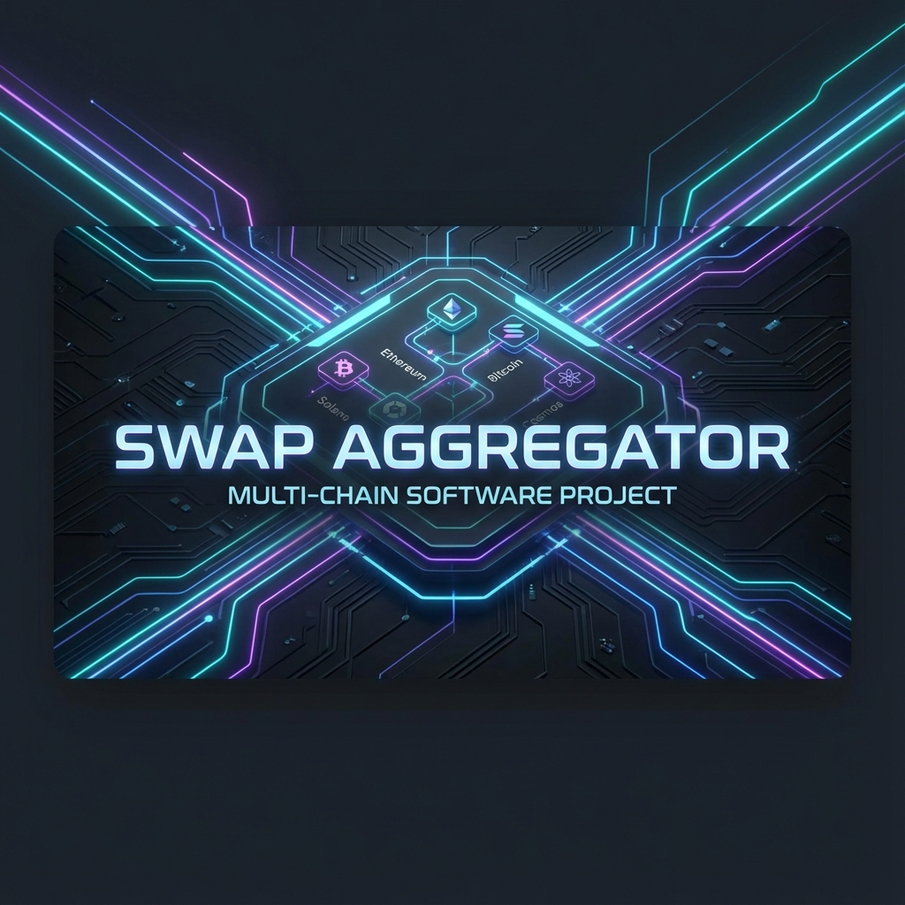
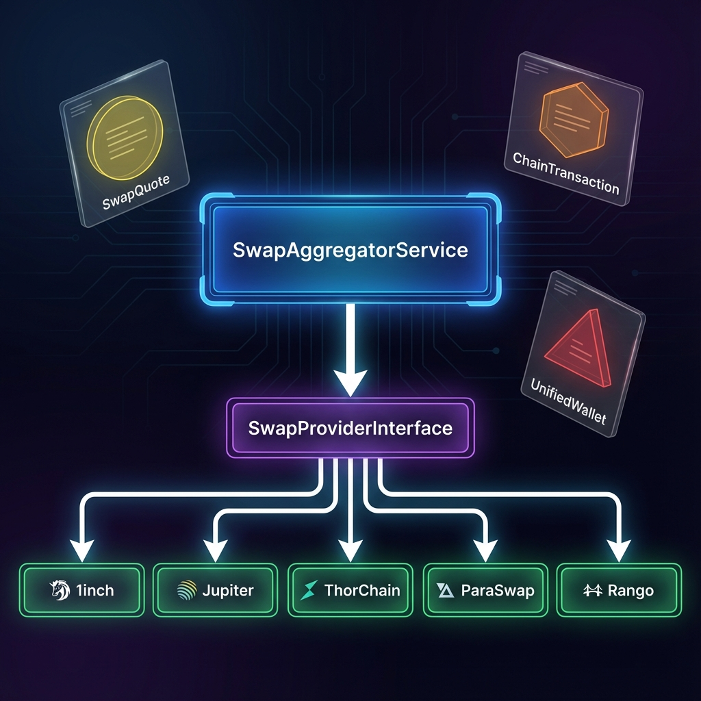
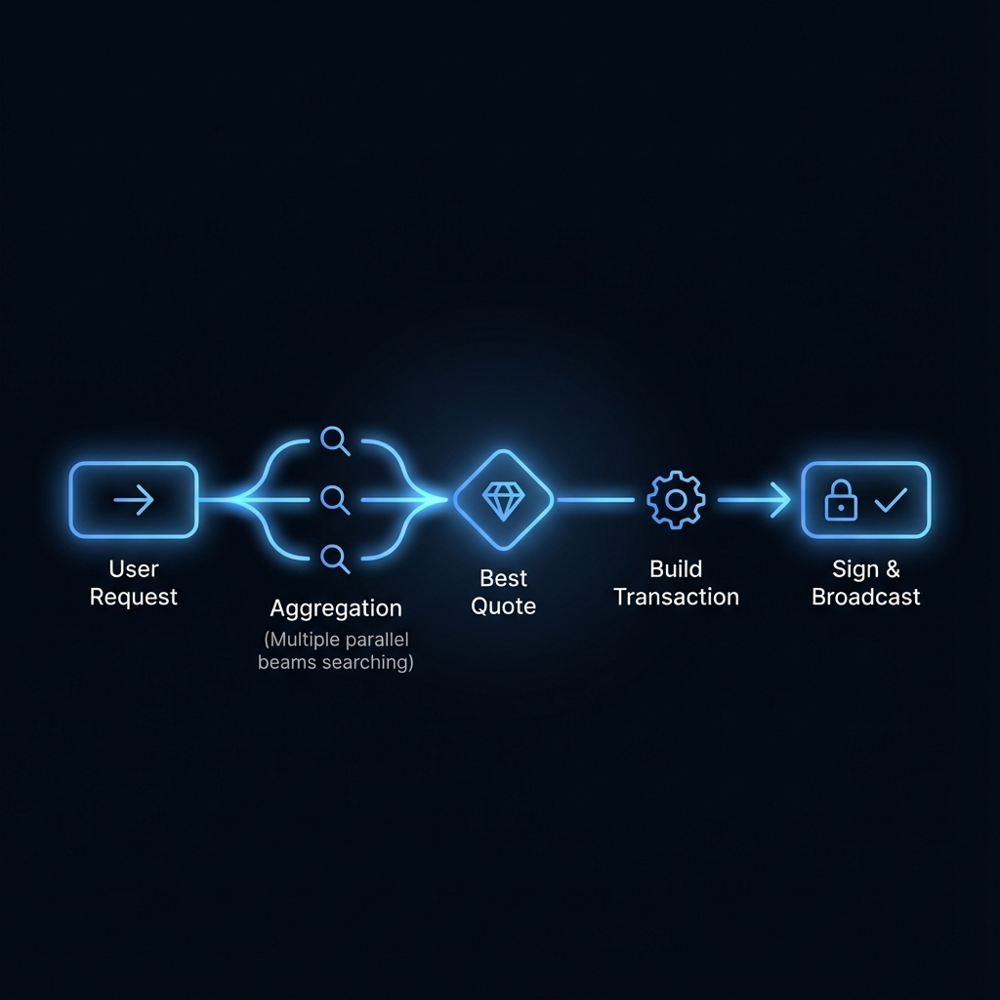

# Dart Multi-Chain Swap Aggregator



A production-ready, unified interface for aggregating crypto swaps and bridges across **EVM**, **Solana**, **Bitcoin (UTXO)**, and **Cosmos** chains.

[](https://dart.dev)
[](LICENSE)
[](#supported-providers)

---

## 🚀 Features

*   **Unified API**: One interface to rule them all (`getQuote`, `buildTransaction`).
*   **Multi-Chain Support**: Native support for **EVM** (Ethereum, BSC, Polygon, L2s), **Solana**, **Bitcoin**, and **Cosmos**.
*   **Advanced Routing**:
    *   **Aggregators**: 1inch, OpenOcean, ParaSwap, Jupiter, Odos, Bebop.
    *   **Bridges**: Across, DeBridge (DLN), Li.Fi, Socket (Bungee), Squid (Axelar), Symbiosis.
    *   **RFQ & Intent**: Hashflow (RFQ), CoW Protocol (Intent-based settlement), WOOFi (sPMM).
*   **Smart Transaction Building**: Automatically generates the correct transaction payload (`EvmTransaction`, `SolanaTransaction`, etc.) based on the chain.
*   **Usage-Ready**: Includes standardized `TransactionSummary`, dynamic `ApprovalMethod` resolution (Standard vs Permit2), and precise gas estimation.

---

## 🏗 Architecture

The aggregator abstracts the complexity of 20+ different APIs into a single `SwapProviderInterface`.



*   **`SwapAggregatorService`**: The main entry point. It queries all registered providers in parallel and returns the best quote.
*   **`SwapProviderInterface`**: The contract that all specific implementations adhere to.
*   **`ChainTransaction`**: A sealed class hierarchy ensuring type safety for different blockchains properties.

---

## 🔄 How It Works



1.  **Request**: You provide `fromChain`, `toChain`, `fromToken`, `toToken`, and `amount`.
2.  **Aggregation**: The service blasts the request to all relevant providers (filtering by supported chains).
3.  **Best Quote**: Quotes are normalized, ranked by output amount (after fees), and the best one is returned.
4.  **Transaction**: You request to build the transaction for the winning quote.
5.  **Execution**: You get a fully constructed transaction object ready for your wallet to sign and broadcast.

---

## 📦 Installation

Add this package to your `pubspec.yaml`:

```yaml
dependencies:
  swap_aggregator:
    path: packages/swap_aggregator
```

---

## 🛠 Usage

### 1. Initialize Service

```dart
import 'package:swap_aggregator/swap_aggregator.dart';

// Inject your API keys where necessary
final providers = [
  ParaSwapProvider(),                 // Aggregator
  OneInchProvider(apiKey: '...'),     // Aggregator
  JupiterProvider(),                  // Solana Aggregator
  ThorChainProvider(),                // Native Cross-Chain (BTC<->ETH)
  HashflowProvider(),                 // RFQ (Zero Slippage)
  AcrossProvider(),                   // Fast Bridge
];

final aggregator = SwapAggregatorService(providers: providers);
```

### 2. Get a Quote

```dart
final params = SwapParams(
  fromChain: ChainId.ethereum,
  toChain: ChainId.arbitrum,          // Cross-chain verified!
  fromToken: 'USDC',
  toToken: 'USDC',
  fromTokenAddress: '0xA0b8...eB48',
  toTokenAddress: '0xFF97...3043',
  amount: Decimal.parse('100.0'),     // 100 USDC (human readable)
  fromTokenDecimals: 6,
  toTokenDecimals: 6,
  userAddress: '0xYourWalletAddress',
  slippage: 0.5,                      // 0.5%
);

final result = await aggregator.getBestQuote(params);

if (result.isSuccess) {
  final quote = result.valueOrNull!;
  print('Best Provider: ${quote.provider}'); // e.g., "Across"
  print('Est. Output: ${quote.outputAmount} USDC');
}
```

### 3. Build & Sign Transaction

```dart
final txResult = await aggregator.buildTransaction(
  quote: quote,
  userAddress: '0xYourWalletAddress',
);

final tx = txResult.valueOrNull!;

if (tx is EvmTransaction) {
  // Send via ethers.js, web3dart, or WalletConnect
  sendTransaction(
    to: tx.to,
    data: tx.data,
    value: tx.value,
  );
} else if (tx is SolanaTransaction) {
  // Sign and send via Solana wallet
  sendSolanaTransaction(tx.base64EncodedTransaction);
}
```

---

## 🌍 Supported Providers

| Provider | Type | Chains | Key Features |
|---|---|---|---|
| **1inch** | Aggregator | EVM (12+) | Deep liquidity, gas optimized |
| **Jupiter** | Aggregator | Solana | The best pricing on Solana |
| **0x** | Aggregator | EVM | Reliability, RFQ limits |
| **ParaSwap** | Aggregator | EVM | Gas refunds, high efficiency |
| **OpenOcean** | Aggregator | EVM + Others | CEX + DEX aggregation |
| **KyberSwap** | Aggregator | EVM (13+) | Capital efficient routes |
| **Odos** | Aggregator | EVM (L2s) | Smart multi-input routing |
| **Bebop** | RFQ | EVM | 0% Slippage, Multi-token swaps |
| **Hashflow** | RFQ | EVM, Solana | MEV-protected, Zero slippage |
| **CoW Protocol**| Context | EVM | Intent-based, MEV protection |
| **ThorChain** | Native Swap| BTC, ETH, etc. | Native asset swaps (no wrapping) |
| **Across** | Bridge | EVM L2s | Fastest optimistic bridging |
| **Symbiosis** | Bridge | Multi-chain | Any-to-Any swaps |
| **DeBridge** | Bridge | EVM, Solana | High speed DLN infrastructure |
| **Li.Fi** | Bridge Agg | Multi-chain | Aggregates bridges & DEXs |
| **Socket** | Bridge Agg | EVM | Bungee implementation |
| **Squid** | Bridge | EVM, Cosmos | Powered by Axelar |
| **Rango** | Meta Agg | All Chains | Super aggregator |
| **Rubic** | Meta Agg | All Chains | Extensive provider coverage |
| **Enso** | Aggregator | EVM | DeFi shortcuts |
| **WOOFi** | Hybrid | EVM | sPMM synthetic liquidity |
| **Uniswap** | DEX | EVM | Direct pool interaction |

---

## 📄 License

MIT
